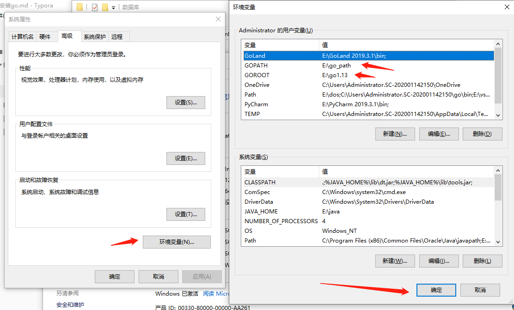
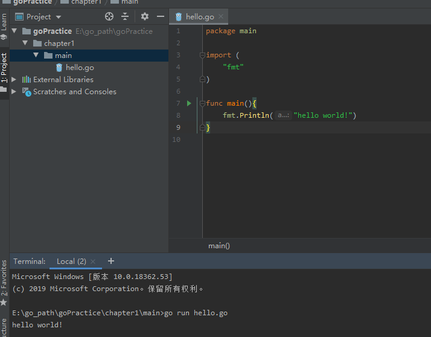

# 第一章 安装并使用运行第一个程序

Go 语言支持以下系统：

- Linux
- FreeBSD
- Mac OS X（也称为 Darwin）
- Windows

安装包下载地址为：https://golang.org/dl/。

如果打不开可以使用这个地址：https://golang.google.cn/dl/。

各个系统对应的包名：

| 操作系统 | 包名                           |
| :------- | :----------------------------- |
| Windows  | go1.4.windows-amd64.msi        |
| Linux    | go1.4.linux-amd64.tar.gz       |
| Mac      | go1.4.darwin-amd64-osx10.8.pkg |
| FreeBSD  | go1.4.freebsd-amd64.tar.gz     |


------

## UNIX/Linux/Mac OS X, 和 FreeBSD 安装

以下介绍了在UNIX/Linux/Mac OS X, 和 FreeBSD系统下使用源码安装方法：

1、下载二进制包：go1.4.linux-amd64.tar.gz。

2、将下载的二进制包解压至 /usr/local目录。

```
tar -C /usr/local -xzf go1.4.linux-amd64.tar.gz
```

3、将 /usr/local/go/bin 目录添加至PATH环境变量：

```
export PATH=$PATH:/usr/local/go/bin
```

> **注意：**MAC 系统下你可以使用 **.pkg** 结尾的安装包直接双击来完成安装，安装目录在 **/usr/local/go/** 下。

------

## Windows 系统下安装

Windows 下可以使用 .msi 后缀(在下载列表中可以找到该文件，如go1.4.2.windows-amd64.msi)的安装包来安装。

默认情况下 **.msi** 文件会安装在 **c:\Go** 目录下。你可以将 **c:\Go\bin** 目录添加到 **Path** 环境变量中。添加后你需要重启命令窗口才能生效。

### 安装测试

创建工作目录 **C:\>Go_WorkSpace**。

## test.go 文件代码：

```go
package main

import "fmt"

func main() {
  fmt.Println("Hello, World!")
}
```


使用 go 命令执行以上代码输出结果如下：

```
C:\Go_WorkSpace>go run test.go

Hello, World!
```

个人具体实践 安装在d盘设置的GOPATH是E:/go_path

本人电脑系统win10 64位 各位如果想从事编程行业，可以使用内存稍微大一些的一般情况下8G内存足以打开Ide和调试项目





如果遇到什么问题 欢迎提问

