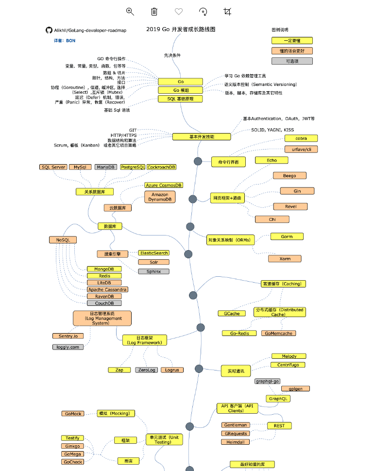

# Go实践教程

从基础实践到项目实践，希望能对你有所帮助，喜欢的小伙伴可以点Star


Go的语法接近[C语言](https://baike.baidu.com/item/C语言)，但对于变量的声明有所不同。Go支持垃圾回收功能。Go的并行模型是以[东尼·霍尔](https://baike.baidu.com/item/东尼·霍尔)的[通信顺序进程](https://baike.baidu.com/item/通信顺序进程)（CSP）为基础，采取类似模型的其他语言包括[Occam](https://baike.baidu.com/item/Occam)和[Limbo](https://baike.baidu.com/item/Limbo)，但它也具有Pi运算的特征，比如通道传输。在1.8版本中开放插件（Plugin）的支持，这意味着现在能从Go中动态加载部分函数。

与C++相比，Go并不包括如[枚举](https://baike.baidu.com/item/枚举)、[异常处理](https://baike.baidu.com/item/异常处理)、[继承](https://baike.baidu.com/item/继承)、[泛型](https://baike.baidu.com/item/泛型)、[断言](https://baike.baidu.com/item/断言)、[虚函数](https://baike.baidu.com/item/虚函数)等功能，但增加了 切片(Slice) 型、并发、管道、垃圾回收、接口（Interface）等特性的语言级支持。Go 2.0版本将支持泛型，对于断言的存在，则持负面态度，同时也为自己不提供类型继承来辩护。

不同于[Java](https://baike.baidu.com/item/Java)，Go内嵌了[关联数组](https://baike.baidu.com/item/关联数组)（也称为[哈希表](https://baike.baidu.com/item/哈希表)（Hashes）或字典（Dictionaries）），就像字符串类型一样。


立刻开始吧！

```go
package main

import (
	"fmt"
)

func main() {
	fmt.Println("hello world!")
}

```

本项目使用指南，访问项目目录下的/out文件夹，使用谷歌浏览器打开index.html


注：学习是一件值得投资的事情，拒绝做伸手党，百度谷歌必应，各种搜索引擎能解决你遇到的大部分问题

本项目中会引用别的网站的较好的文章，如有侵权，请联系删除。


欢迎各位小伙伴提供各种有趣的示例，以便于帮助更多的小伙伴，请不要吝啬分享，在分享的同时，也是自己的知识点的回顾！


学习路线



