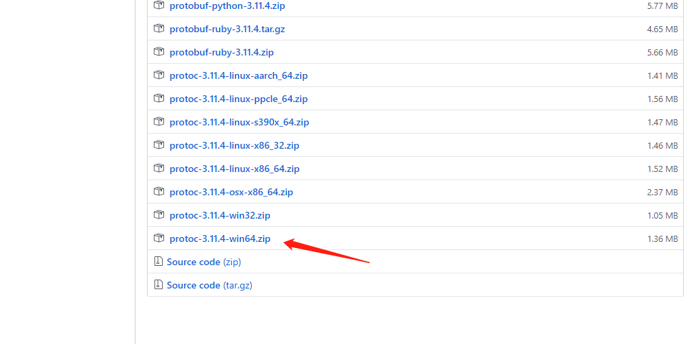
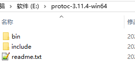

# GRPC入门

## 简述

gRPC 是一个高性能、开源和通用的 RPC 框架，面向移动和 HTTP/2 设计。目前提供 C、Java 和 Go 语言版本，分别是：grpc, grpc-java, grpc-go. 其中 C 版本支持 C, C++, Node.js, Python, Ruby, Objective-C, PHP 和 C# 支持。

gRPC 基于 HTTP/2 标准设计，带来诸如双向流、流控、头部压缩、单 TCP 连接上的多复用请求等特性。这些特性使得其在移动设备上表现更好，更省电和节省空间占用。

## 调用模型


立即开始，安装必要的包

1. 1go get -u google.golang.org/grpc


1.2 下载protobuf并解压到指定位置

选择与自己系统相匹配的版本

https://github.com/protocolbuffers/protobuf/releases



解压到一个文件夹下
E:\protoc-3.11.4-win64



把这个目录添加到环境变量里面 E:\protoc-3.11.4-win64\bin


下面了解一下

###### protocol buffers简介

https://www.cnblogs.com/jifeng/p/11847744.html


安装插件

go get github.com/golang/protobuf/protoc-gen-go

检查一下GOPATH的bin目录


是否存在protoc-gen-go.exe

**然后把GOPATH的bin目录添加到环境变量的PATH下**

新建目录

├─grpcpro
│  ├─pbfiles
│  └─services


pbfiles下面的文件

Prod.proto

```protobuf
syntax="proto3";
package services;
message ProdRequest {
    int32 prod_id =1;//传入的商品id
}

message ProdResponse {
    int32 prod_stock=1;//商品库存
}
```


输入命令（在pbfiles文件路径下）

执行命令可能会找不到路径 请重复上诉的步骤,以及重新打开新的终端

protoc ./Prod.proto --go_out=../services/


将下面的添加到proto文件中

```
service ProdService {
	rpc GetProdStock(ProdRequest) returns (ProdResponse);
}
```

那么现在的Prod.proto就为：

```protobuf
syntax="proto3";
package services;
message ProdRequest {
    int32 prod_id =1;//传入的商品id
}

message ProdResponse {
    int32 prod_stock=1;//商品库存
}

service ProdService {
	rpc GetProdStock(ProdRequest) returns (ProdResponse);
}
```

E:\go_path\go_st\grpc\grpcpro\pbfiles>  

protoc --go_out=plugins=grpc:../services Prod.proto

接下来创建

E:\go_path\go_st\grpc\grpcpro\services\ProdService.go

```go
package services

import (
	"context"
)

type ProdService struct {
}

func (this *ProdService) GetProdStock(ctx context.Context, in *ProdRequest,) (*ProdResponse, error) {

	return &ProdResponse{ProdStock:20}, nil
}

```

